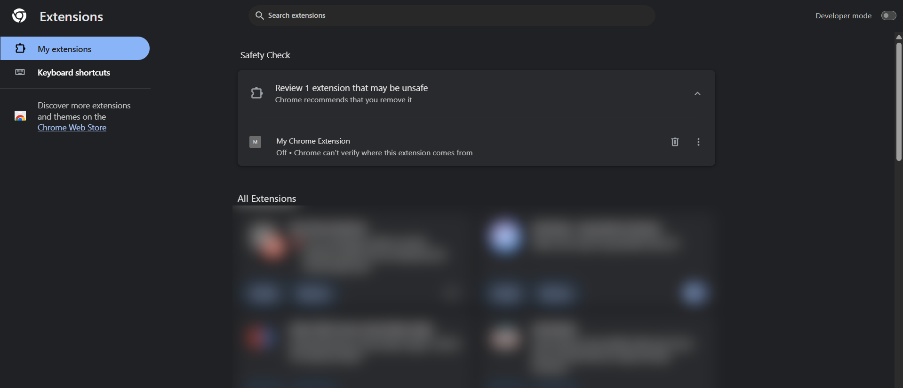
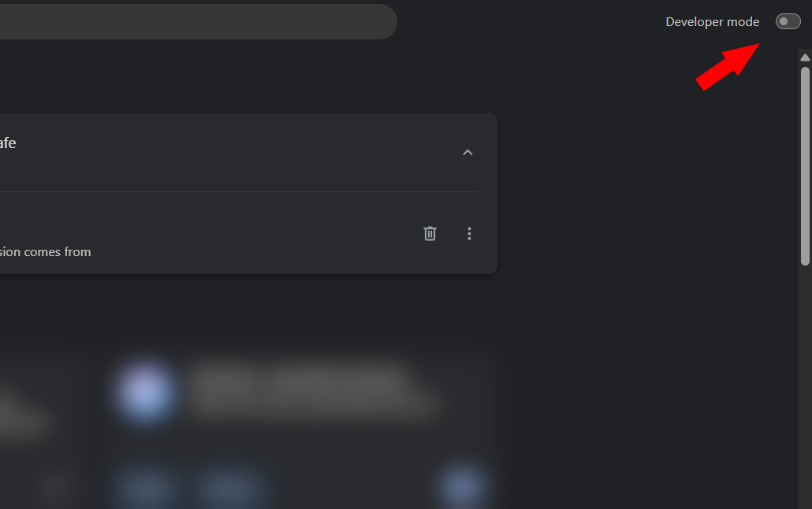
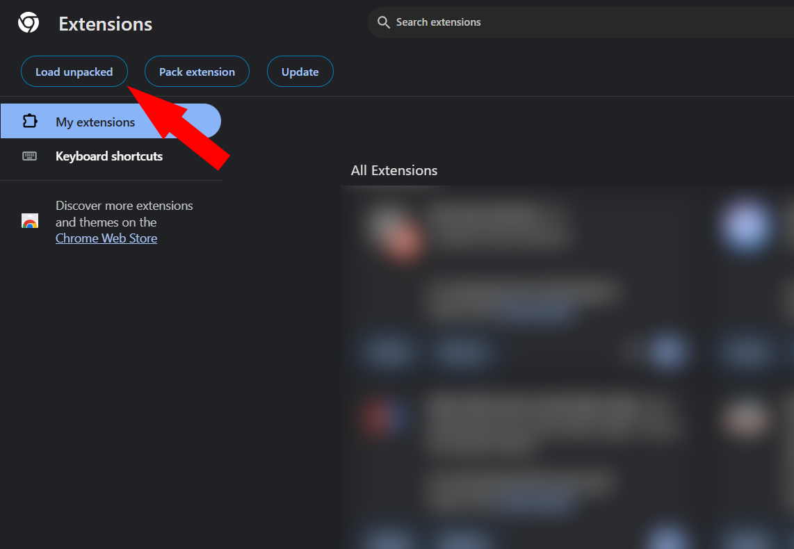
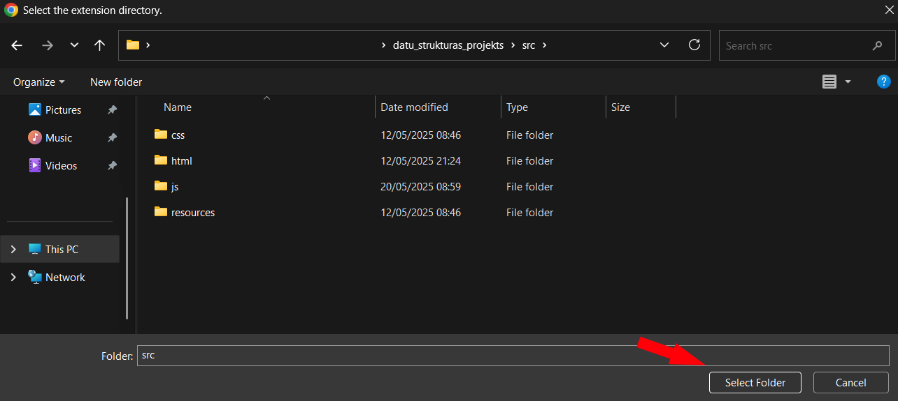
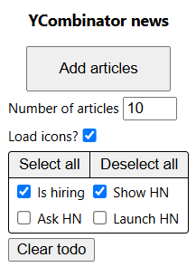

# 📚 Uzziņas/populārzinātnes rakstu apkopošanas paplašinājums

## 📌 Projekta uzdevums

Šī projekta mērķis ir izstrādāt Chrome pārlūka paplašinājumu, kas iegūst populārzinātnes rakstu datus no angļu valodas vietnes news.ycombinator.com, un automātiski tos sakārto pārlūkprogrammas grāmatzīmju sadaļā.

Rakstu lasīšanas progress tiek pārvaldīts šādā veidā:
- Neizlasīti raksti tiek pievienoti "📖 To Read" sadaļai.
- Raksti, kas ir iepriekš atvērti lasīšanai, tiek pārvietoti uz "📖 In Progress" sadaļu.
- Pēc raksta izlasīšanas, nospiežot pogu "✓" lapas stūrī, raksts tiek pārvietots uz "📖 Done" sadaļu.

## 🛠️ Izmantotās tehnoloģijas
- Projekts ir realizēts JavaScript programmēšanas valodā.
- Paplašinājuma darbību veikšanai tika izmantots Chrome API(grāmatzīmju izveidošanai/pārvietošanai, komunikācijai starp cilnēm/paplašinājumu, jaunu cilnju atvēršana, papildus satura iespraušana lapas saturā).
- Projektā tiek implementēta 'Red-Black Tree' datu struktūra(Binary Search Tree ar bināras krāsas īpašībām virsotnēs), lai novērstu duplikātu rakstu saglabāšanu, kas garantē O(log n) pārbaudes laika sarežģītību.

## ⚙️ Funkcionalitāte
- Automātiska rakstu iegūšana no 'news.ycombinator.com/news'
- Grāmatzīmju izveide un pārvaldīšana("To Read", "In Progress", "Done")
- Iegūto rakstu filtrēšana pēc tēmas("Is hiring", "Ask HN", "Show HN", "Launch HN")
- Lietotāja izvēle - iegūto rakstu skaits, ikonu ielādēšana, "To Read" iztukšošana

## 📥 Instalācijas instrukcijas
1. Klonē šo projektu:
   
   `git clone https://github.com/ASomniphobeHere/datu_strukturas_projekts.git`
2. Atver Chrome pārlūkprogrammu un dodies uz "Extensions" sadaļu

   
3. Lapas augšējā stūrī atzīmē "Developer Mode"
   
   
4. Nospied "Load Unpacked", uznirstošajā logā navigējas līdz 'datu_strukturas_projekts/src' mapei
   
   
   
5. Uzspied taustiņu kombināciju "Ctrl+Shift+B", lai parādītu grāmatzīmju joslu
   
   
6. Paplašinājums tagad ir pieejams pārlūkprogrammā un gatavs izmantošanai.
   
   

## 📖 Lietošanas instrukcijas
1. Atver paplašinājumu un izvēlies iestatījumus
   - Norādi iegūto rakstu skaitu
   - Izvēlies filtrētās tēmas("Is hiring", "Ask HN", ...)
   - Izvēlies, vai ielādēt rakstu ikonas

2. Nospied "Add Articles", lai pievienotu jaunus rakstus "To Read" mapei

3. No "To Read" mapes izvēlies rakstu lasīšanai

    Kad raksts tiek atvērts:

     - Tas tiek automātiski pārvietots uz "In Progress"

     - Apakšējā labajā stūrī parādīsies zaļa poga “✓”

4. Nospied “✓” pogu, kad esi izlasījis rakstu — tas tiks pārvietots uz "Done"
5. Ja nepieciešams, paplašinājumā nospied "Clear Todo", lai iztīrītu "To Read" mapi